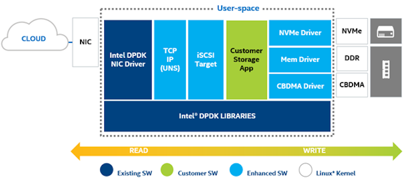
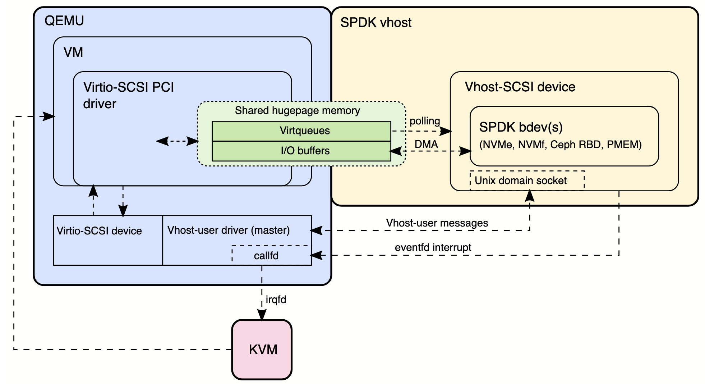

# SPDK

The Storage Performance Development Kit (SPDK) provides a set of tools for writing high performance user-mode storage applications. It achieves high performance by moving all the necessary drivers into user space and operating in a polled mode instead of relying on interrupts, which avoids kernel context switches and eliminates interrupt handling overhead.

See also: [DPDK](DPDK.md)

## Differences from DPDK
See section in [DPDK](DPDK.md#differences-from-spdk).

## Storage networking
Storage networking lets computers store data on devices that aren't directly attached to them. This allows multiple computers to access the same storage. This also allows pooling storage resources instead of each machine having its own storage.

### Traditional storage networking
- Uses kernel drivers and interrupts
- Has multiple data copies
- Context switches between kernel and user space
- Heavy CPU overhead

### SPDK's approach to storage networking
- User space drivers. This avoids context switches by bypassing the kernel. This allows direct communication between NVMe devices and user space.
- Polled I/O. Instead of waiting for interrupts, SPDK continuously checks for completed I/O. This results in lower latency.
- Zero-copy data path
    - Data moves directly between network and storage. This avoids the need to copy data to intermediate buffers.
- Supports TCP and RDMA
- Each core runs independently. No locking is necessary.
    - Avoids locks on the I/O path and instead relies on message passing.

## TCP vs RDMA
RDMA allows direct memory access from one computer to another without involving the operating system or processor. It provides extremely low latency and high throughput network communication.

- TCP is widely supported and runs on any operating system
- TCP has higher CPU usage than RDMA because RDMA bypasses the CPU
- TCP requires copies between kernel and user space

## Terminology
- Target: (`spdk_nvmf_tgt`) a collection of subsystems with their associated namespaces. Created via `spdk_nvmf_tgt_create`.
- Initiator: aka "host". The client that connects to the target.
- Subsystem: (`spdk_nvmf_subsystem`) an NVMe-oF subsystem. Created via `spdk_nvmf_subsystem_create`.
- Namespace: (`spdk_nvmf_ns`) an NVMe-oF namespace. Namespaces are `bdevs`.
- Transport: (`spdk_nvmf_transport`) an abstraction for a network fabric. Can be TCP or RDMA.
- Poll group: (`spdk_nvmf_poll_group`) a *collection* of network connections that can be polled as a unit. Abstraction over `epoll`?
- Listener: (`spdk_nvmf_listener`) a network address at which the target will accept new connections.

## Architecture


*Image: https://www.intel.com/content/www/us/en/developer/articles/tool/introduction-to-the-storage-performance-development-kit-spdk.html*

### NVMe devices with SPDK
For SPDK to use an NVMe device, it must be *detached* from the kernel mode driver and *attached* to a Linux user space framework such as `VFIO`.

### VFIO
Virtual function I/O (VFIO) is a kernel utility for providing secure access to PCI devices in user space. VFIO is for writing user space drivers.

#### `vfio-user`
`vfio-user` is a protocol that allows a device to be emulated in a separate process outside of a virtual machine monitor. `vfio-user` is based on the VFIO `ioctl` (input/output control) interface.

### vhost



*Image: https://spdk.io/doc/vhost_processing.html*

### Block device

A `bdev` (block device) is an abstraction layer. It provides a unified block storage interface above various storage technologies, including NVMe. Block devices follow SPDK's design (user-space, polled-IO, zero-copy, lockless).

#### `bdev` architecture
- SPDK bdev layer: a generic block device abstraction that presents a consistent API regardless of the underlying storage type
- NVMe driver: SPDK includes a user-space NVMe driver that bypasses the kernel
- NVMe bdev module: an adapter which connects the generic bdev interface with an actual NVMe device

## Events
Doc: https://spdk.io/doc/event.html

Events allow cross-thread communication via message passing. The event framework runs one event loop thread per CPU core. These threads are called *reactors*, and they process incoming events.

### Reactors
A *reactor* is a thread which processes events. SPDK spawns *one reactor thread per core*. Each reactor has a lock-free queue for incoming events to that core. Events are executed FIFO. Event functions should *never* block and should execute quickly.

### Pollers
*Pollers* are functions which are executed repeatedly until unregistered. They are registered by `spdk_poller_register`.

The reactor event loop intersperses calls to the pollers along with other event processing. Pollers can be executed every iteration of the event loop, or scheduled periodically.

## Functions
- `spdk_nvme_connect`: (synchronous) attaches to one NVMe controller (ex: `/dev/nvme1`). Should be done first. Has transport ID for local or remote. `spdk_nvme_detach` frees the resource.
    - `spdk_nvme_connect_async`: newer, async version. Useful for hot insert.
- `spdk_nvme_probe`: (synchronous) similar to `spdk_nvme_connect` but can attach to multiple (or all) NVMe controllers at once.
    - `spdk_nvme_probe_async`: newer, async version. Useful for hot insert.

## Structs
- `spdk_bdev_desc`: opaque data type containing `spdk_bdev`, options, stuck io timeout, and more. Can be populated using `spdk_bdev_open_ext`. Should be closed via `spdk_bdev_close`
- `spdk_bdev_io`: documented structure used with I/O operations
- `spdk_bdev`: can be obtained by name using `spdk_bdev_get_by_name`

## Commands / utilities

### `spdk_nvme_identify`
Prints out information about all of the NVMe devices on your system.

```bash
# show help text
spdk_nvme_identify -H
```

### `spdk_top`
`spdk_top` is useful to see details which `top` and `htop` do not show. For example, `top` will always show 100% CPU usage, but this does not indicate if that machine needs more cores.

```bash
spdk_top -r <path_to_socket>
```

- Press 1, 2, 3 to change between the three tabs
- Press `Enter` on a selection to see more details
- Threads tab:
    - Shows app_thread and engine threads
    - Shows which core each thread is running. app_thread is core 0.
    - Shows timed pollers running on app_thread
- Pollers tab:
    - Shows `bdev_nvme_poll` which runs constantly (100% CPU usage)
    - Shows app thread pollers running on timer
- Cores tab:
    - Shows similar view as threads tab

### `spdk_nvme_perf`
`spdk_nvme_perf` is a performance tool, similar to FIO. It has less overhead and fewer features as compared to FIO.

```bash
$ sudo spdk_nvme_perf -q 1 -o 4096 -w write -L -r "trtype:TCP adrfam:IPv4 traddr:127.0.0.1 trsvcid:4420 subnqn:nqn.2024-08.io.spdk:cnode0 hostnqn:nqn.2014-08.org.nvmexpress:uuid:<uuid>" -t 10 --no-huge -s 4096

Initializing NVMe Controllers
Attached to NVMe over Fabrics controller
Associating TCP NSID 1 with lcore 0
Initialization complete. Launching workers.
================================================================
                                                Latency(us)
Device Information    :     IOPS  MiB/s Average    min       max
TCP NSID 1 from core 0: 14443.30  56.42   69.21  32.37  18010.21
Total                 : 14443.30  56.42   69.21  32.37  18010.21

Summary latency data for TCP from core 0:
================================================================
  1.00000% :    33.019us
 99.99999% : 18082.586us
```

- `-q`: io depth
- `-o`: io size in bytes
- `-w`: io pattern (read, write, randread, randwrite, rw, randrw)
- `-L`: enable latency tracking via sw, default: disabled
- `-r`: transport. The example above uses TCP loopback
- `-t`: time (seconds)
- `--no-huge`: SPDK is run without hugepages
- `-s`: DPDK huge memory size in MB

## Resources
- https://spdk.io/
- https://github.com/spdk/spdk
- https://youtu.be/_LEAhq-jZ7o
- https://www.intel.com/content/www/us/en/developer/articles/tool/introduction-to-the-storage-performance-development-kit-spdk.html
- https://youtu.be/VcgnZDXiJls
- https://github.com/nutanix/libvfio-user
- https://spdk.io/doc/bdev.html
- High Performance NVMe Virtualization with SPDK and vfio-user, https://youtu.be/vXubQC5uaDA
- https://youtu.be/2symMaslxQ0
- https://youtu.be/IeYYFs9y2IM (similar to 2symMaslxQ0)
- https://www.youtube.com/watch?v=ZVq5WR9umtc&list=PL4eJZ5XvN_LSH0fTNLRvn0UQouKiBGH3g&index=11
- "SPDK NVMe: An In-depth Look at its Architecture and Design", https://youtu.be/pZb_Kn9D2jA
- https://spdk.io/doc/nvmf_tgt_pg.html
- "SPDK Demo: SPDK Top", https://youtu.be/iEv-vWf-NUM
- "SPDK State of the Union", https://youtu.be/WKxZCETU03Q
- https://spdk.io/doc/event.html
